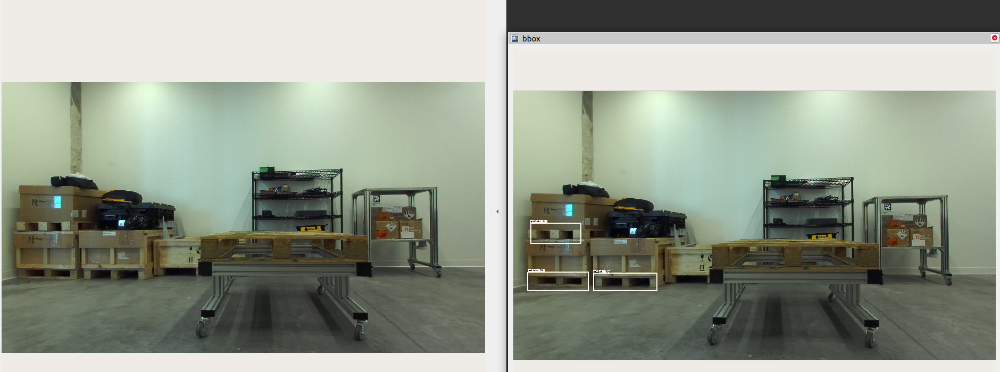

# Object detection using bounding box 
The second task required detecting warehouse pallets in the scene, with focus on pallet bases. I utilized [YOLOv3](https://arxiv.org/abs/1804.02767) for this task due to its simplicity, striking a balance between speed and accuracy, making it particularly suitable for real-time applications. It employs a single convolutional neural network to predict bounding boxes and class probabilities directly from images. Initially, I implemented the network from scratch but could not achieve the desired mAP. To address this, I forked the network implementation from [here](https://github.com/ultralytics/yolov3). The training results are summarized below:

`NOTE: All the results were aggregated after training for 200 epochs`

<br>

| metrics      | train / valid | test (hold-out) | 
| -------------- | --------------- | ---------------| 
|mAP@50| 74 | 67| 
|mAP@50:95:0.05|44|33|

## Installation
For the purpose of this assignment, I have setup ROS2 nodes with provisions for inferencing using webcam and rosbag. To get started, make sure you have ROS2 (*ROS2-foxy Ubuntu 20.04 LTS*) installed in your system and install the necessary python modules to run the inference node. To infer on ros bag, place the extracted file (.db3 and yaml) inside the `bbox/bag` directory.

<br>

```
## Install the necessary python modules using Conda. 
conda env create -f env.yml

## Open a terminal and export the environment python path to the ros setup file 
echo "export PYTHONPATH=$YOUR_PYTHON_PATH" >> /opt/ros/foxy/setup.bash 
source /opt/ros/foxy/setup.bash

## Create a ROS2 workspace as follows 
mkdir -p ros2_ws/src
cd ros2_ws/src 
git clone https://github.com/splion-360/peer-robotics.git
cd ..
colcon build 

## Download the model weights to start inference. 
cd ros2_ws/src/bbox
./setup.sh ## Will create two folders inside the /seg directory and will download the model weights. Make sure that the model weights are correctly downloaded

```

## Inference
Once the model weights are downloaded, navigate to the root of the workspace and launch the ROS2 nodes. 
```
cd ros2_ws
colcon build --packages-select bbox
source install/setup.bash
ros2 launch bbox launch_yolov3.launch.py
```
This should open a RViz window which displays the source image and the corresponding mask. By default, the inference is done on the ros bag file.  

<br>

| Backbone     | GPU | Average Inference (ms)| 
| -------------- | --------------- | ---------------| 
|Darknet-53| NVIDIA GeForce RTX 3050 | 58| 

<br>


