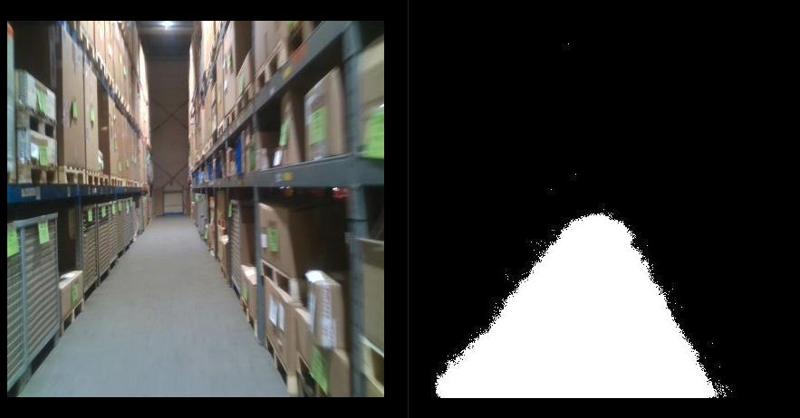

# Binary Image Segmentation 
The first task was binary segmentation of the warehouse floor from the background in RGB images. For this purpose, [SegNet](https://arxiv.org/abs/1511.00561) , a widely-used encoder-decoder architecture designed for real-time semantic segmentation, was employed. The model was trained on annotated images and evaluated on a hold-out (test) set. To measure performance, Mean Average Precision (mAP) was used as the primary metric, complemented by Dice Score and Intersection over Union (IoU) to provide deeper insights into false positives and segmentation quality. The training results are summarized as follows:
<br>
`NOTE: All the results were aggregated after training for 100 epochs`

<br>

| metrics      | train / valid | test (hold-out) | 
| -------------- | --------------- | ---------------| 
|mAP@50:95:0.05| 92.6 | 81.6| 
|accuracy|95|94|
|dice score|88|81|
|IoU|83.5| 76.4|

## Installation 
### `NOTE:` You can skip this section and move to the next if you are working with Docker container
For the purpose of this assignment, I have setup ROS2 nodes with provisions for inferencing using webcam and rosbag. To get started, make sure you have ROS2 (*ROS2-foxy Ubuntu 20.04 LTS*) installed in your system and install the necessary python modules to run the inference node. To infer on ros bag, place the extracted file (.db3 and yaml) inside the `seg/bag` directory and update the name accordingly inside the launch file. 
`
<br>

```
## Install the necessary python modules using Conda. 
conda env create -f env.yml

## Open a terminal and export the environment python path to the ros setup file 
echo "export PYTHONPATH=$YOUR_PYTHON_PATH" >> /opt/ros/foxy/setup.bash 
source /opt/ros/foxy/setup.bash

## Create a ROS2 workspace as follows 
mkdir -p ros2_ws/src
cd ros2_ws/src 
git clone https://github.com/splion-360/peer-robotics.git .
cd ..
colcon build 

## Download the model weights to start inference. 
cd src/seg
./setup.sh ## Will create two folders inside the /seg directory and will download the model weights. Make sure that the model weights are correctly downloaded

```

## Download weights 
Navigate to the `src/seg/seg/weights` folder and place the pretrained weights. The weights can be downloaded [here](https://drive.google.com/file/d/1V0Ax7RgARmh00KV3CjMrs1TXdk3zrDib/view?usp=sharing).
`NOTE`: If using a containerized environment, make sure to place the weights in the respective folders within the container
## Inference
Once the model weights are downloaded, navigate to the root of the workspace and launch the ROS2 nodes. 
```
cd ros2_ws
colcon build --packages-select seg
source install/setup.bash
ros2 launch seg launch_segnet_launch.py
```
This should open a RViz window which displays the source image and the corresponding mask. By default, the inference is done on the ros bag file.  

<br>

| Backbone     | GPU | Average Inference (ms)| 
| -------------- | --------------- | ---------------| 
|VGG-16 (pretrained encoder)| NVIDIA GeForce RTX 3050 | 60| 

<br>


